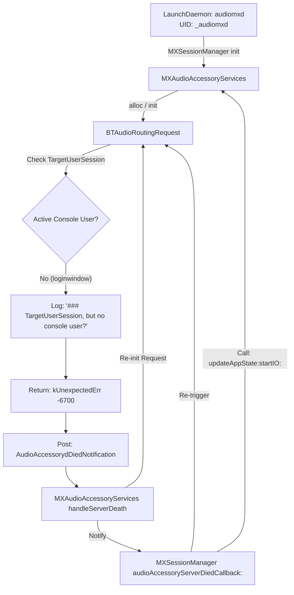

# Deep Dive: Technical Root Cause Analysis of `audiomxd` 100% CPU Runaway

## Executive Summary

On macOS Tahoe 26.x (and Apple Silicon macOS 15.x releases), headless systems, unattended servers, CI/CD runners, and workstations sitting at `loginwindow` experience severe CPU runaway in `/usr/libexec/audiomxd`. The daemon pegs 1 CPU core at 90-100% CPU and floods the Unified Log at over **24,000 lines/second** (~1.48 million lines/minute), exhausting disk space (often 100+ GiB in a single incident).

This document presents the low-level binary analysis and causal breakdown of why this occurs.

---

## The Subsystem Architecture

The audio experience infrastructure on macOS Tahoe involves three primary binaries:

1. **`/usr/libexec/audiomxd`**
   - Runs as a system LaunchDaemon under UID 294 (`_audiomxd`).
   - Host process for `AudioSessionServer.framework` and `MediaExperience.framework`.
   - Manages audio session policies, routing contexts, and AirPods smart switching state.
2. **`/System/Library/CoreServices/audioaccessoryd`**
   - Runs as a user LaunchAgent defined in `/System/Library/LaunchAgents/com.apple.cloudpaird.plist` (Label: `com.apple.BTServer.cloudpairing`).
   - Declares `<key>LimitLoadToSessionType</key><string>Aqua</string>`.
   - Provides MachServices `com.apple.AudioAccessoryServices` and `com.apple.BluetoothServices`.
3. **`BluetoothServices.framework` / `MediaExperience.framework`**
   - Contains the client-side Objective-C classes `BTAudioRoutingRequest` and `MXAudioAccessoryServices`.



---

## Detailed Step-by-Step Causal Trace

### Step 1: Aqua Session Boundary Restriction
Because `/System/Library/LaunchAgents/com.apple.cloudpaird.plist` is marked `LimitLoadToSessionType = Aqua`, launchd only bootstraps `audioaccessoryd` when an interactive Aqua graphical session is active (UID >= 500). When the user logs out or the machine boots into `loginwindow`, no Aqua session exists, and `audioaccessoryd` is not running.

### Step 2: `MXSessionManager` Initialization
In `audiomxd`, `MXSessionManager` initializes during early daemon startup. In `-[MXSessionManager init]`:
```objc
[MXAudioAccessoryServices sharedInstance];
[[NSNotificationCenter defaultCenter] addObserver:self
                                         selector:@selector(audioAccessoryServerDiedCallback:)
                                             name:kMXAudioAccessoryServicesNotification_AudioAccessoryServerDied
                                           object:[MXAudioAccessoryServices sharedInstance]];
```

### Step 3: `MXAudioAccessoryServices` Setup
In `-[MXAudioAccessoryServices init]`:
- It checks `+[MXAudioAccessoryServices isSupported]`, which calls `+[BTAudioRoutingRequest isSupported]`. (In macOS Tahoe, this returns `true`).
- It creates a dedicated serial dispatch queue: `com.apple.mediaexperience.AudioAccessoryServices`.
- It registers an observer for `AudioAccessorydDiedNotification` mapped to `-[MXAudioAccessoryServices handleServerDeath]`.
- It allocates a `BTAudioRoutingRequest` instance via `-[MXAudioAccessoryServices initializeAudioAccessoryConnection]`.

### Step 4: `BTAudioRoutingRequest` Validation Failure
Inside `BluetoothServices.framework`:
- `BTAudioRoutingRequest` checks `TargetUserSession`.
- At `loginwindow`, `TargetUserSession` is `NULL` (or UID 0).
- `BTAudioRoutingRequest` outputs:
  ```
  audiomxd: (CoreUtils) [com.apple.bluetooth:BTAudioRoutingRequest] TargetUserSession NULL 0
  audiomxd: (CoreUtils) [com.apple.bluetooth:BTAudioRoutingRequest] ### TargetUserSession, but no console user?
  audiomxd: (CoreUtils) [com.apple.bluetooth:BTAudioRoutingRequest] ### UpdateAudioState failed to start XPC: kUnexpectedErr (No user logged in)
  ```
- `BTAudioRoutingRequest` invokes its internal `_reportError:` handler.
- `_reportError:` outputs `### audioaccessoryd died` and posts `AudioAccessorydDiedNotification` through `NSNotificationCenter`.

### Step 5: The Dual Feedback Cycle
1. `-[MXAudioAccessoryServices handleServerDeath]` catches `AudioAccessorydDiedNotification`:
   - Logs `"-MXAudioAccessoryServices- -[MXAudioAccessoryServices handleServerDeath]: audioaccessoryd died :("`.
   - Schedules a block on its serial queue that executes `finalizeAudioAccessoryConnection` followed immediately by `initializeAudioAccessoryConnection`.
   - Posts `kMXAudioAccessoryServicesNotification_AudioAccessoryServerDied`.
2. `-[MXSessionManager audioAccessoryServerDiedCallback:]` catches `kMXAudioAccessoryServicesNotification_AudioAccessoryServerDied`:
   - Erroneously logs `"-MXSessionManager- Syncing with AudioAccessoryServices as they just recovered."`.
   - Immediately calls `[[MXAudioAccessoryServices sharedInstance] updateAppState:sessions startIO:1]`.
3. Both `initializeAudioAccessoryConnection` and `updateAppState:startIO:` execute `updateAudioState:`, which immediately checks `TargetUserSession`, fails with `kUnexpectedErr (No user logged in)`, and fires `AudioAccessorydDiedNotification` again.

---

## Timing and Resource Consumption Measurements

Using high-resolution timestamp profiling on live hardware:
- **Duration per single loop cycle**: **177 microseconds** (0.000177 seconds).
- **Cycle frequency**: **~5,650 iterations per second**.
- **CPU utilization**: **90.2% - 94.1%** of a single high-performance core (Thread State `Rs`).
- **Unified Log flood**: **~24,800 entries/sec** (247,975 entries per 10 seconds).
- **Log data generation**: **~14 MB/minute uncompressed**, exhausting 100 GiB `/var/log` within 5 days.
