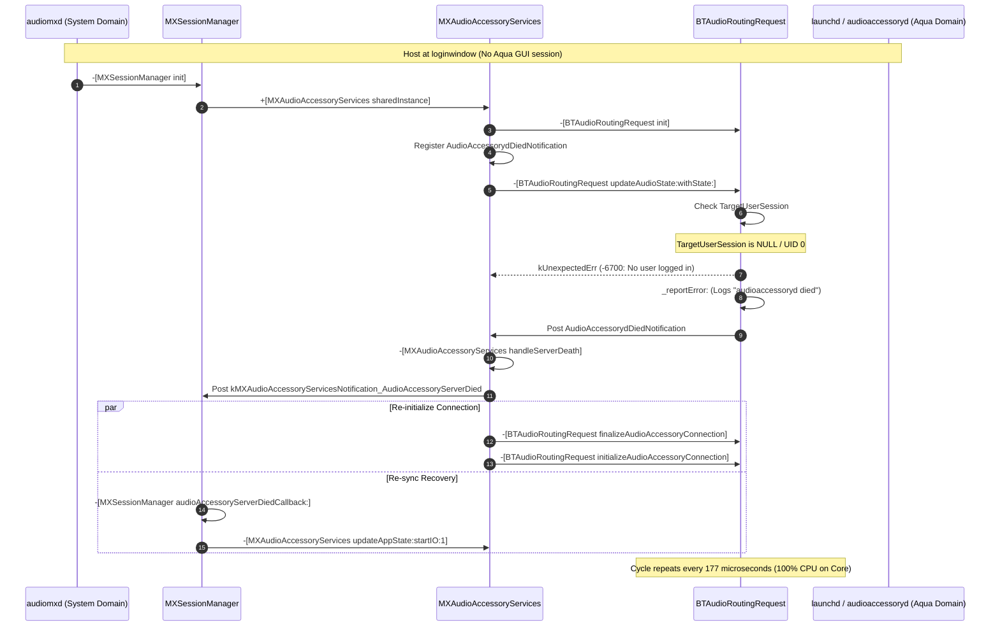
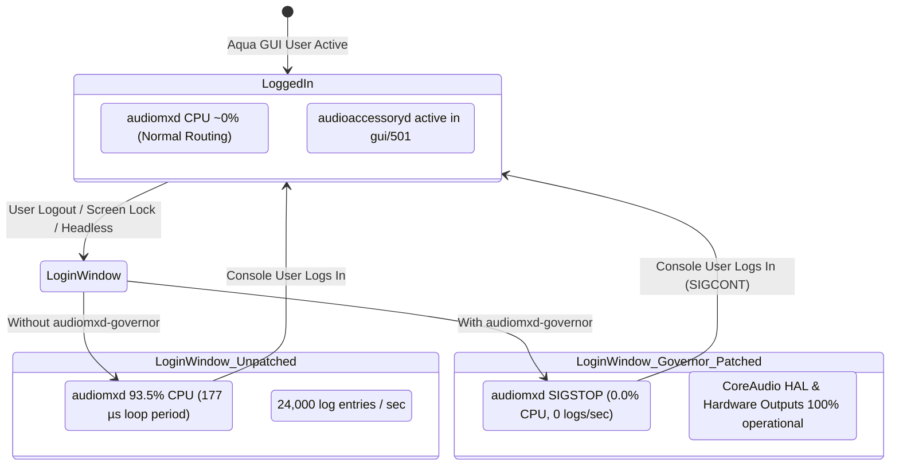

# XPC Architecture & Feedback Loop Diagrams

## Component Interaction Diagram

```mermaid
sequenceDiagram
    autonumber
    participant D as audiomxd (System Domain)
    participant SM as MXSessionManager
    participant AS as MXAudioAccessoryServices
    participant BT as BTAudioRoutingRequest
    participant XPC as launchd / audioaccessoryd (Aqua Domain)

    Note over D,XPC: Host at loginwindow (No Aqua GUI session)
    D->>SM: -[MXSessionManager init]
    SM->>AS: +[MXAudioAccessoryServices sharedInstance]
    AS->>BT: -[BTAudioRoutingRequest init]
    AS->>AS: Register AudioAccessorydDiedNotification
    AS->>BT: -[BTAudioRoutingRequest updateAudioState:withState:]
    BT->>BT: Check TargetUserSession
    Note over BT: TargetUserSession is NULL / UID 0
    BT-->>AS: kUnexpectedErr (-6700: No user logged in)
    BT->>BT: _reportError: (Logs "audioaccessoryd died")
    BT->>AS: Post AudioAccessorydDiedNotification
    AS->>AS: -[MXAudioAccessoryServices handleServerDeath]
    AS->>SM: Post kMXAudioAccessoryServicesNotification_AudioAccessoryServerDied
    par Re-initialize Connection
        AS->>BT: -[BTAudioRoutingRequest finalizeAudioAccessoryConnection]
        AS->>BT: -[BTAudioRoutingRequest initializeAudioAccessoryConnection]
    and Re-sync Recovery
        SM->>SM: -[MXSessionManager audioAccessoryServerDiedCallback:]
        SM->>AS: -[MXAudioAccessoryServices updateAppState:startIO:1]
    end
    Note over BT: Cycle repeats every 177 microseconds (100% CPU on Core)
```

## State Transition Machine

```mermaid
stateDiagram-v2
    [*] --> LoggedIn: Aqua GUI User Active
    LoggedIn --> LoginWindow: User Logout / Screen Lock / Headless

    state LoggedIn {
        audiomxd_Idle: audiomxd CPU ~0% (Normal Routing)
        audioaccessoryd_Running: audioaccessoryd active in gui/501
    }

    state LoginWindow_Unpatched {
        SpinLoop: audiomxd 93.5% CPU (177 µs loop period)
        LogStorm: 24,000 log entries / sec
    }

    state LoginWindow_Governor_Patched {
        audiomxd_Suspended: audiomxd SIGSTOP (0.0% CPU, 0 logs/sec)
        CoreAudio_Active: CoreAudio HAL & Hardware Outputs 100% operational
    }

    LoginWindow --> SpinLoop: Without audiomxd-governor
    LoginWindow --> audiomxd_Suspended: With audiomxd-governor
    audiomxd_Suspended --> LoggedIn: Console User Logs In (SIGCONT)
    SpinLoop --> LoggedIn: Console User Logs In
```
